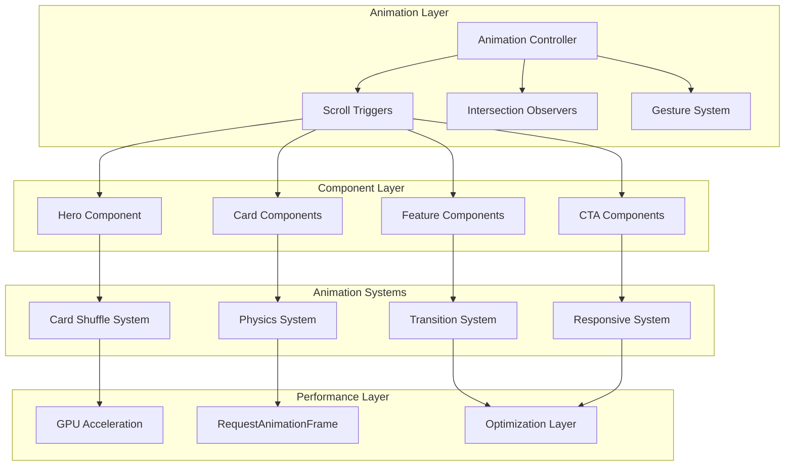
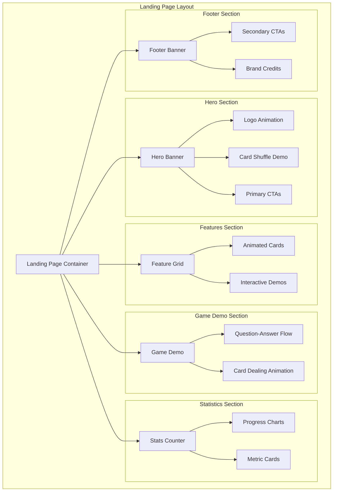

# Design Document

## Overview

The Animated Landing Page transforms the current static TechQS homepage into an immersive, card-themed experience that showcases the digital card game platform through sophisticated animations and interactive elements. The design leverages modern web animation techniques, the newly added logo assets, and creates a cohesive brand experience that guides visitors from initial interest to user registration.

The page follows a storytelling approach where card animations progressively reveal information about the platform, creating an engaging narrative that mirrors the actual game experience. All animations are built with performance and accessibility in mind, using CSS transforms, GPU acceleration, and respecting user motion preferences.

## Architecture

### Animation Architecture



### Component Structure



## Components and Interfaces

### Core Animation Components

#### 1. Card Animation System
```typescript
interface CardAnimationProps {
  variant: 'shuffle' | 'deal' | 'flip' | 'hover' | 'stack';
  cards: CardData[];
  autoPlay?: boolean;
  trigger?: 'scroll' | 'hover' | 'click' | 'auto';
  duration?: number;
  stagger?: number;
}

interface CardData {
  id: string;
  front: React.ReactNode;
  back: React.ReactNode;
  position: { x: number; y: number; z: number };
  rotation: { x: number; y: number; z: number };
}
```

#### 2. Hero Section Components
```typescript
interface HeroSectionProps {
  logos: {
    primary: string; // purple filled
    secondary: string; // black outline
    favicon: string;
  };
  isAuthenticated: boolean;
  user?: User;
}

interface LogoAnimationProps {
  variant: 'purple-filled' | 'purple-outline' | 'black-filled' | 'black-outline';
  size: 'sm' | 'md' | 'lg' | 'xl';
  animate: boolean;
}
```

#### 3. Interactive Demo Components
```typescript
interface GameDemoProps {
  demoCards: DemoCard[];
  autoAdvance?: boolean;
  showControls?: boolean;
}

interface DemoCard {
  id: string;
  question: string;
  answer: string;
  difficulty: 'easy' | 'medium' | 'hard';
  category: string;
}
```

#### 4. Statistics Animation Components
```typescript
interface AnimatedCounterProps {
  value: number;
  duration?: number;
  format?: (value: number) => string;
  trigger?: 'scroll' | 'mount';
}

interface ProgressChartProps {
  data: ChartData[];
  animationDelay?: number;
  chartType: 'bar' | 'line' | 'pie' | 'donut';
}
```

### Animation Utilities

#### 1. Card Physics Engine
```typescript
class CardPhysics {
  static shuffle(cards: CardElement[]): Animation;
  static deal(cards: CardElement[], positions: Position[]): Animation;
  static flip(card: CardElement, axis: 'x' | 'y'): Animation;
  static stack(cards: CardElement[], offset: number): Animation;
  static hover(card: CardElement, intensity: number): Animation;
}

interface Position {
  x: number;
  y: number;
  z: number;
  rotation: { x: number; y: number; z: number };
}
```

#### 2. Scroll Animation Controller
```typescript
class ScrollAnimationController {
  private observers: IntersectionObserver[];
  private animations: Map<string, Animation>;
  
  registerAnimation(element: Element, animation: AnimationConfig): void;
  unregisterAnimation(elementId: string): void;
  pauseAll(): void;
  resumeAll(): void;
}

interface AnimationConfig {
  trigger: 'enter' | 'exit' | 'progress';
  threshold: number;
  animation: KeyframeEffect;
  options: AnimationOptions;
}
```

## Data Models

### Animation State Management
```typescript
interface AnimationState {
  isPlaying: boolean;
  currentAnimation: string | null;
  queuedAnimations: string[];
  performance: {
    fps: number;
    memoryUsage: number;
    gpuAccelerated: boolean;
  };
}

interface CardState {
  id: string;
  position: Position;
  isFlipped: boolean;
  isHovered: boolean;
  isSelected: boolean;
  animationState: 'idle' | 'animating' | 'paused';
}
```

### Brand Asset Management
```typescript
interface BrandAssets {
  logos: {
    purpleFilled: string;
    purpleOutline: string;
    blackFilled: string;
    blackOutline: string;
  };
  colors: {
    primary: string;
    secondary: string;
    accent: string;
    background: string;
  };
  typography: {
    heading: string;
    body: string;
    mono: string;
  };
}
```

### Demo Content Models
```typescript
interface DemoContent {
  heroCards: DemoCard[];
  featureShowcase: FeatureDemo[];
  gameFlow: GameStep[];
  statistics: StatisticItem[];
}

interface FeatureDemo {
  id: string;
  title: string;
  description: string;
  animation: AnimationType;
  interactive: boolean;
  cards: CardData[];
}

interface GameStep {
  id: string;
  title: string;
  description: string;
  cardAction: 'draw' | 'flip' | 'answer' | 'score';
  duration: number;
}
```

## Error Handling

### Animation Error Management
```typescript
class AnimationErrorHandler {
  static handlePerformanceIssue(error: PerformanceError): void {
    // Reduce animation complexity
    // Fall back to simpler animations
    // Disable GPU acceleration if needed
  }
  
  static handleBrowserCompatibility(error: CompatibilityError): void {
    // Provide fallback animations
    // Use CSS transitions instead of Web Animations API
    // Disable unsupported features
  }
  
  static handleResourceLoading(error: ResourceError): void {
    // Show loading states
    // Provide placeholder content
    // Retry loading with exponential backoff
  }
}

interface PerformanceError {
  type: 'low-fps' | 'high-memory' | 'gpu-unavailable';
  threshold: number;
  current: number;
}
```

### Accessibility Error Handling
```typescript
class AccessibilityHandler {
  static respectMotionPreferences(): void {
    // Check prefers-reduced-motion
    // Disable animations if requested
    // Provide alternative static presentations
  }
  
  static ensureKeyboardNavigation(): void {
    // Add focus indicators
    // Provide skip links
    // Ensure all interactive elements are accessible
  }
  
  static provideAlternativeContent(): void {
    // Add alt text for visual animations
    // Provide text descriptions of card movements
    // Ensure screen reader compatibility
  }
}
```

## Testing Strategy

### Animation Testing
```typescript
describe('Card Animation System', () => {
  it('should shuffle cards with realistic physics', () => {
    // Test card positions during shuffle
    // Verify animation timing
    // Check for smooth transitions
  });
  
  it('should respect reduced motion preferences', () => {
    // Mock prefers-reduced-motion
    // Verify animations are disabled
    // Check alternative presentations
  });
  
  it('should maintain 60fps during complex animations', () => {
    // Monitor frame rate
    // Test on various devices
    // Verify GPU acceleration usage
  });
});
```

### Performance Testing
```typescript
describe('Landing Page Performance', () => {
  it('should load within performance budget', () => {
    // Test initial page load
    // Verify animation asset loading
    // Check memory usage
  });
  
  it('should handle multiple simultaneous animations', () => {
    // Test animation queue management
    // Verify no animation conflicts
    // Check resource cleanup
  });
});
```

### Accessibility Testing
```typescript
describe('Landing Page Accessibility', () => {
  it('should be navigable with keyboard only', () => {
    // Test tab order
    // Verify focus indicators
    // Check skip links
  });
  
  it('should provide alternative content for animations', () => {
    // Test screen reader compatibility
    // Verify alt text presence
    // Check ARIA labels
  });
});
```

## Performance Considerations

### Animation Optimization
1. **GPU Acceleration**
   - Use `transform3d()` for all card movements
   - Leverage `will-change` property strategically
   - Batch DOM updates using `requestAnimationFrame`

2. **Memory Management**
   - Clean up animation listeners on component unmount
   - Use object pooling for card instances
   - Implement lazy loading for animation assets

3. **Rendering Optimization**
   - Use CSS containment for animation boundaries
   - Implement virtual scrolling for large card lists
   - Optimize animation keyframes for browser efficiency

### Asset Loading Strategy
```typescript
class AssetLoader {
  static preloadCriticalAssets(): Promise<void> {
    // Preload logo SVGs
    // Cache animation sprites
    // Load critical CSS animations
  }
  
  static lazyLoadSecondaryAssets(): Promise<void> {
    // Load demo content
    // Cache additional animations
    // Preload next section assets
  }
}
```

### Responsive Design Considerations
1. **Mobile Optimizations**
   - Reduce animation complexity on mobile devices
   - Use touch-friendly interaction areas
   - Optimize for various screen sizes and orientations

2. **Progressive Enhancement**
   - Provide basic functionality without JavaScript
   - Layer animations on top of static content
   - Ensure graceful degradation

3. **Performance Budgets**
   - Limit animation asset sizes
   - Monitor runtime performance metrics
   - Implement adaptive quality based on device capabilities

This design creates an engaging, performant, and accessible animated landing page that effectively showcases the TechQS card game platform while maintaining excellent user experience across all devices and accessibility needs.