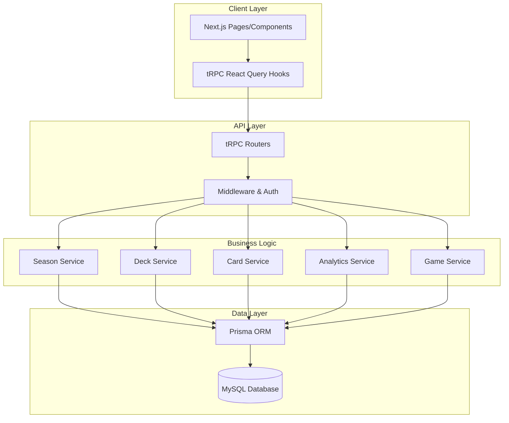
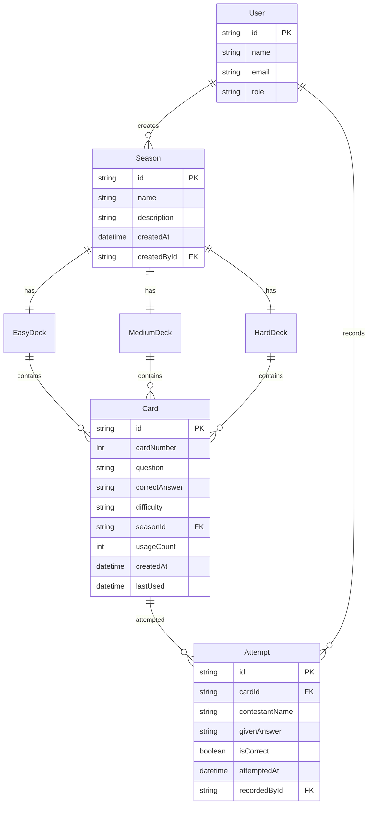

# Design Document

## Overview

The techQ's Digital Card Deck System is built on the existing Next.js application stack, extending the current Prisma/MySQL database with new models to represent seasons, card decks, questions, and contestant attempts. The system leverages the existing tRPC API architecture and NextAuth authentication to provide a secure, type-safe interface for managing the digital card deck experience.

The design follows a card game metaphor where each season contains three decks (easy, medium, hard), each deck contains up to 52 cards, and each card holds a technology question. The system tracks card usage, contestant attempts, and provides comprehensive analytics.

## Architecture

### High-Level Architecture



### Database Schema Design

The system extends the existing Prisma schema with the following core entities:



## Components and Interfaces

### Core Components

#### 1. Season Management Components
- **SeasonList**: Displays all available seasons with statistics
- **SeasonForm**: Create/edit season information
- **SeasonDashboard**: Overview of a specific season's decks and usage

#### 2. Deck Management Components
- **DeckView**: Visual representation of a card deck with remaining cards
- **DeckStats**: Statistics for a specific difficulty deck
- **CardDrawer**: Interface for drawing random cards from a deck

#### 3. Card Management Components
- **CardEditor**: Form for creating/editing questions and answers
- **CardView**: Display individual card with question, answer, and stats
- **CardList**: Paginated list of cards in a deck

#### 4. Game Flow Components
- **ContestantForm**: Input form for contestant information
- **QuestionDisplay**: Shows drawn question to contestant
- **AnswerRecorder**: Records contestant's answer and result

#### 5. Analytics Components
- **AnalyticsDashboard**: Comprehensive statistics overview
- **UsageCharts**: Visual representations of card usage patterns
- **PerformanceMetrics**: Contestant success rates and trends

### API Interface Design

#### tRPC Router Structure

```typescript
// Main router structure
export const appRouter = createTRPCRouter({
  season: seasonRouter,
  card: cardRouter,
  game: gameRouter,
  analytics: analyticsRouter,
});

// Season router procedures
seasonRouter = {
  create: protectedProcedure,
  getAll: protectedProcedure,
  getById: protectedProcedure,
  update: protectedProcedure,
  delete: protectedProcedure,
}

// Card router procedures
cardRouter = {
  create: protectedProcedure,
  getByDeck: protectedProcedure,
  update: protectedProcedure,
  delete: protectedProcedure,
  drawRandom: protectedProcedure,
}

// Game router procedures
gameRouter = {
  recordAttempt: protectedProcedure,
  getAttemptHistory: protectedProcedure,
  resetDeck: protectedProcedure,
}

// Analytics router procedures
analyticsRouter = {
  getSeasonStats: protectedProcedure,
  getCardUsage: protectedProcedure,
  getContestantPerformance: protectedProcedure,
  exportData: protectedProcedure,
}
```

## Data Models

### Extended Prisma Schema

```prisma
model Season {
  id          String   @id @default(cuid())
  name        String
  description String?
  createdAt   DateTime @default(now())
  updatedAt   DateTime @updatedAt
  
  createdBy   User   @relation(fields: [createdById], references: [id])
  createdById String
  
  cards     Card[]
  attempts  Attempt[]
  
  @@index([createdAt])
}

model Card {
  id            String   @id @default(cuid())
  cardNumber    Int      // 1-52 for each difficulty in a season
  question      String   @db.Text
  correctAnswer String   @db.Text
  difficulty    Difficulty
  usageCount    Int      @default(0)
  createdAt     DateTime @default(now())
  updatedAt     DateTime @updatedAt
  lastUsed      DateTime?
  
  season   Season @relation(fields: [seasonId], references: [id], onDelete: Cascade)
  seasonId String
  
  attempts Attempt[]
  
  @@unique([seasonId, difficulty, cardNumber])
  @@index([seasonId, difficulty])
  @@index([usageCount])
}

model Attempt {
  id             String   @id @default(cuid())
  contestantName String
  givenAnswer    String   @db.Text
  isCorrect      Boolean
  attemptedAt    DateTime @default(now())
  
  card   Card   @relation(fields: [cardId], references: [id], onDelete: Cascade)
  cardId String
  
  season   Season @relation(fields: [seasonId], references: [id], onDelete: Cascade)
  seasonId String
  
  recordedBy   User   @relation(fields: [recordedById], references: [id])
  recordedById String
  
  @@index([attemptedAt])
  @@index([seasonId])
  @@index([contestantName])
}

enum Difficulty {
  EASY
  MEDIUM
  HARD
}

// Extend existing User model
model User {
  // ... existing fields
  role        Role     @default(HOST)
  seasons     Season[]
  attempts    Attempt[]
}

enum Role {
  HOST
  PRODUCER
  ADMIN
}
```

### Business Logic Models

```typescript
// Core interfaces for type safety
interface SeasonWithStats {
  id: string;
  name: string;
  description?: string;
  createdAt: Date;
  totalCards: number;
  totalAttempts: number;
  easyDeckCount: number;
  mediumDeckCount: number;
  hardDeckCount: number;
}

interface CardWithUsage {
  id: string;
  cardNumber: number;
  question: string;
  correctAnswer: string;
  difficulty: Difficulty;
  usageCount: number;
  lastUsed?: Date;
  successRate: number;
}

interface AttemptRecord {
  id: string;
  contestantName: string;
  givenAnswer: string;
  isCorrect: boolean;
  attemptedAt: Date;
  card: {
    cardNumber: number;
    difficulty: Difficulty;
    question: string;
  };
}
```

## Error Handling

### Error Categories and Responses

1. **Validation Errors**
   - Invalid card numbers (must be 1-52)
   - Empty questions or answers
   - Invalid difficulty levels
   - Duplicate card numbers in same deck

2. **Business Logic Errors**
   - Drawing from empty deck
   - Attempting to add more than 52 cards to a deck
   - Recording attempts for non-existent cards
   - Unauthorized access to seasons

3. **Database Errors**
   - Connection failures
   - Constraint violations
   - Transaction rollback scenarios

### Error Handling Strategy

```typescript
// Custom error classes
class DeckEmptyError extends Error {
  constructor(difficulty: Difficulty, seasonId: string) {
    super(`No cards available in ${difficulty} deck for season ${seasonId}`);
  }
}

class DeckFullError extends Error {
  constructor(difficulty: Difficulty) {
    super(`${difficulty} deck is full (52 cards maximum)`);
  }
}

// tRPC error handling
const cardRouter = createTRPCRouter({
  drawRandom: protectedProcedure
    .input(z.object({ seasonId: z.string(), difficulty: z.enum(['EASY', 'MEDIUM', 'HARD']) }))
    .mutation(async ({ input, ctx }) => {
      try {
        return await drawRandomCard(input.seasonId, input.difficulty);
      } catch (error) {
        if (error instanceof DeckEmptyError) {
          throw new TRPCError({
            code: 'BAD_REQUEST',
            message: error.message,
          });
        }
        throw new TRPCError({
          code: 'INTERNAL_SERVER_ERROR',
          message: 'Failed to draw card',
        });
      }
    }),
});
```

## Testing Strategy

### Unit Testing
- **Service Layer Tests**: Test business logic for card drawing, attempt recording, and analytics calculations
- **Utility Function Tests**: Test helper functions for card shuffling, statistics calculations
- **Validation Tests**: Test input validation and error handling

### Integration Testing
- **API Route Tests**: Test tRPC procedures with mock database
- **Database Tests**: Test Prisma queries and transactions
- **Authentication Tests**: Test role-based access control

### End-to-End Testing
- **Game Flow Tests**: Complete contestant attempt workflow
- **Season Management Tests**: Create season, add cards, record attempts
- **Analytics Tests**: Verify statistics accuracy across different scenarios

### Testing Tools and Setup
```typescript
// Example test structure
describe('Card Drawing Service', () => {
  it('should draw random unused card from deck', async () => {
    // Setup: Create season with cards
    // Action: Draw card
    // Assert: Card is returned and marked as used
  });
  
  it('should throw error when deck is empty', async () => {
    // Setup: Create season with no cards
    // Action: Attempt to draw card
    // Assert: DeckEmptyError is thrown
  });
});
```

### Performance Considerations

1. **Database Indexing**
   - Index on `(seasonId, difficulty)` for fast deck queries
   - Index on `usageCount` for analytics
   - Index on `attemptedAt` for time-based queries

2. **Query Optimization**
   - Use database transactions for attempt recording
   - Implement pagination for large card lists
   - Cache frequently accessed statistics

3. **Caching Strategy**
   - Cache season statistics using React Query
   - Implement optimistic updates for card draws
   - Cache deck counts to avoid repeated database queries

This design provides a robust foundation for the techQ's Digital Card Deck System while leveraging the existing Next.js/Prisma/tRPC architecture. The modular approach allows for incremental development and easy testing of individual components.